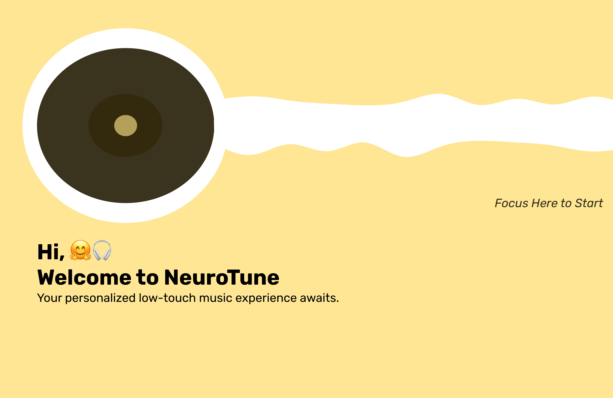
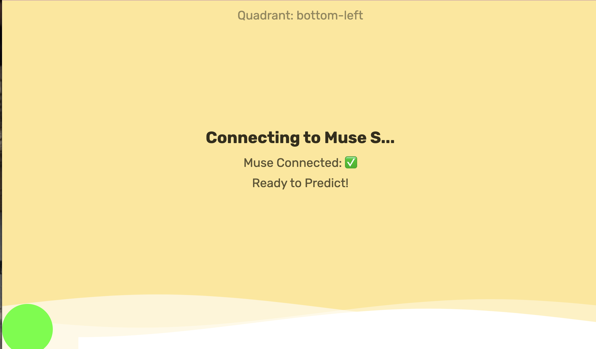

# 🎵 NeuroTune: Redefining Music Accessibility for All Abilities 🎵


### **What Inspired Us?**  
Music is one of the most universal sources of comfort and joy. For many of us, the process of finding the right playlist is simple: we open Spotify or Apple Music and search for "happy playlist" or "sad playlist." But have you ever considered how many steps this actually involves? Or the level of fine motor control required to navigate through these apps?

Now imagine someone with Parkinson's disease or motor tremors. These seemingly simple tasks become overwhelming. Technology has the power—and responsibility—to bridge this gap. **NeuroTune** was built with one mission: to ensure everyone can experience the same joy and comfort of music, regardless of physical limitations.


## 🌟 **What Is NeuroTune?**
**NeuroTune** is a groundbreaking application designed to empower individuals with motor impairments, such as Parkinson’s disease, by combining:
- **Real-Time Eye-Tracking** to enable effortless navigation.
- **Mood Detection with EEG Data** from the Muse S device to create personalized music experiences.

This hands-free system provides users with instant access to tailored playlists based on their emotions, making music more accessible and impactful. Users can navigate through the application by simply focusing their gaze on an option for 3 seconds. The **🧠 brain-eye emoji cursor** provides intuitive, real-time feedback as it tracks their eye movements, ensuring a smooth and interactive experience.


## 💡 **Key Features**

### 🎯 **Real-Time Eye Tracking**
We trained our **custom eye-tracking neural network** to map gaze positions to specific screen quadrants. Users can navigate the app with just their eyes, no need for physical touch or mouse movements.

### 🧠 **Mood Detection**
Using EEG data collected via the **Muse S device**, we trained a neural network to classify emotional states like happiness, sadness, relaxation, and more. NeuroTune uses these insights to tailor playlists that match the user’s mood.

### 🎵 **Spotify Integration**
The app connects directly with Spotify to fetch and play personalized playlists based on the detected mood. Whether you're feeling joyful or reflective, NeuroTune brings you the perfect soundtrack.

### 💻 **Accessible and Aesthetic UI**
- **Large readable fonts** and a **clean yellow background** ensure the interface is intuitive and welcoming.
- A subtle **aesthetic green ball cursor** smoothly transitions across the screen, showing users exactly where their gaze is focused.
- Real-time visual feedback highlights active quadrants to enhance accessibility.

### 🌐 **Hands-Free Navigation**
Users can control the app entirely with their eyes:
- Move your gaze to navigate between interface options.
- Engage in mood detection and enjoy therapeutic music without lifting a finger.

---

## 📽 **Explanation Video**
Learn about the inspiration and functionality of NeuroTune through our explanation video:  
<video width="100%" controls>
  <source src="media/NeuroTune_Explanation.mp4" type="video/mp4">
  Your browser does not support the video tag.
</video>  

---

## 📸 **Screenshots of the Application**

### **Homepage**

**🧠 Brain-Eye Emoji Cursor**: The eye-tracking cursor (a brain-eye emoji) moves with your gaze, providing real-time visual feedback.


### **Mood Detection Screen**



### **Music Player of Recommended Playlist**


---


## ⚙️ **Technology Stack**

### **Core Machine Learning**
- **Custom Eye-Tracking Model**: Trained on relative pupil positions to accurately predict screen quadrants.
- **Muse S Emotion Model**: Maps EEG signals from the Muse S headband to emotional states like happiness or sadness.

### **Frontend**
- **HTML5**, **CSS3**, **JavaScript**
- **Socket.IO** for real-time bidirectional communication between the server and the browser.
- Smooth animations for gaze-based interaction.

### **Backend**
- **Flask**: Python-based web framework for serving the application.
- **Flask-SocketIO**: Enables real-time updates to the UI based on gaze predictions.

### **Computer Vision**
- **OpenCV**: Captures and processes real-time video streams for eye-tracking.
- **Dlib**: Detects facial landmarks to isolate the eyes and calculate pupil positions.

### **APIs**
- **Spotify API**: Retrieves playlists based on mood predictions and streams music directly within the app.

### **Tools & Libraries**
- **NumPy**: Numerical computations for machine learning models.
- **Scikit-learn**: Training and evaluating neural networks.
- **Pickle**: For model serialization.
- **Eventlet**: Asynchronous capabilities for real-time Flask apps.


## 🛠 **How We Built It**

1. **Training the Mood Detection Model**
   - We collected EEG data using the Muse S headband across different emotional states.
   - Using this labeled data, we trained a neural network to classify emotions like happiness, sadness, and relaxation.

2. **Training the Eye-Tracking Model**
   - Captured over 100 images of gaze positions for each screen quadrant.
   - Extracted relative pupil positions and trained a custom eye-tracking model to map these positions to screen quadrants.

3. **Real-Time Communication**
   - Integrated Flask-SocketIO to send gaze predictions from the backend to the browser in real-time.
   - The frontend responds instantly to user gaze with cursor movement and quadrant highlights.

4. **Seamless User Experience**
   - Designed a simple, visually pleasing UI with large fonts and intuitive navigation.
   - The cursor movement and quadrant highlights provide immediate feedback, making the app feel responsive and alive.


## 🚀 **How to Get Started**

1. Clone the repository:
   ```bash
   git clone https://github.com/yourusername/NeuroTune.git
   cd NeuroTune
   ```

2. Set up the environment:
   ```bash
   python3 -m venv venv
   source venv/bin/activate
   pip install -r requirements.txt
   ```

3. Train the models:
   ```bash
   python utils/train_quadrant_model.py
   ```

4. Start the server:
   ```bash
   python app.py
   ```

5. Access the app at `http://localhost:5000` and enjoy!


## 🤝 **Contributing**
We welcome contributions from the community! Whether it’s improving the eye-tracking model, optimizing the UI, or suggesting new features, your input is valued.

---

### **License**
This project is licensed under the MIT License. See the [LICENSE](LICENSE) file for more details.  

---

Let’s make music accessible for all. 🎶 Together, we can change lives.


